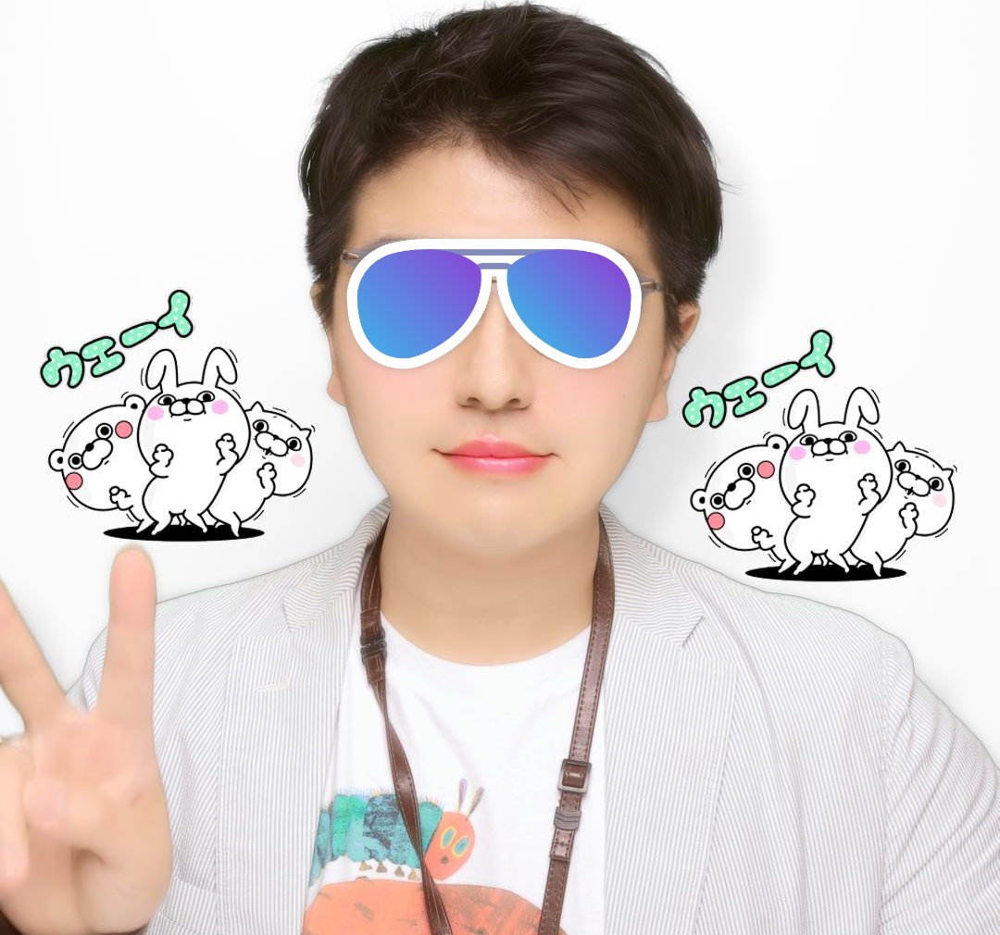
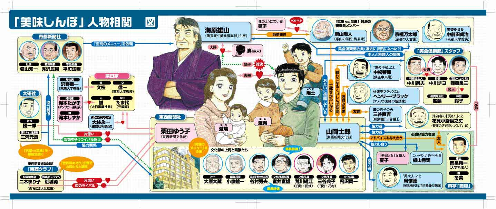
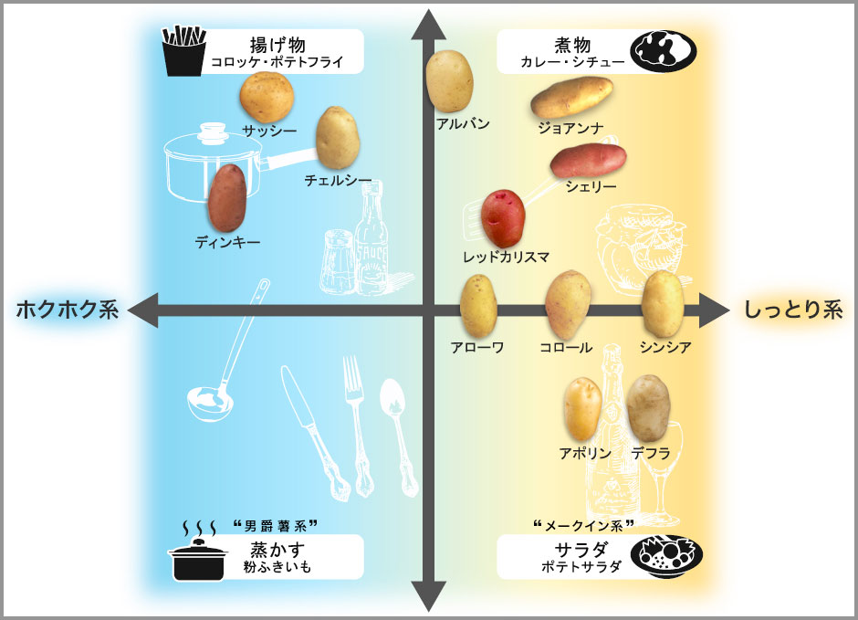

# who's this OSSAN<br>（だれだこのおっさんは）

```{r include = FALSE}
require(tidyverse)
require(lubridate)
require(ggthemes)
require(ggimage)
```

## 自己紹介

<div class="column1">



</div>

<div class="column2">
|名前|mrk　hrhs<br>（@muraki_ng）|
|:-----------|:------------|
|年齢|３６歳<br>（統計上正真正銘のおっさん）|
|所属|F0層向け機械の製造を主力事業とする某エンタメ企業|
|職種|マーケティングリサーチャー（自称）|
|仕事|アンケートやIoTデータで<br>事業部に横からふんわりと<br>ツッコミを入れる係|

</div>
* Rおじさんになることを夢見るおっさん
* 言うことは総じて残念です。ご承知おきください。
<aside class="notes">
ノートだよ！
</aside>


# 今日言いたいこと

## これだけ

* 分析は相互行為（平たくいえばコミュニケーション）
* 相手に伝えることは可視化で
* いま、知識も実力も経験も持っていないなら、<br>多少のゲタくらい履いとこう
* ggplotには<br>
深い統計的知識も<br>
強力なエンジニアリングスキルも<br>
豊富なビジネス経験も　　　　　　　<b>すべて不要</b>
* つまり<font color = blue>無限の可能性！</font>

<aside class="notes">
ノートだよ！
</aside>


# 意識高い系グラフでチームの<br>パフォーマンスをパワフルに<br>モチベートするのはアグリーでFIX！

## ...はい？

* 事業部は事業内のフレームに囚われがち（文化、とも）
* 組織がハンパに大きくなってくると、<br>（時として<b><font color=red>無駄にもなる…</font></b>）数字が求められる
* 数字に対するリテラシーは人によってアレ
    * そんなことで無駄な対立を生むの、もうやめよう？

→<font color = "blue", size = 15>可視化、</font>ダイジ！

<aside class="notes">
ノートなんだよ！
</aside>


## 改めて、「可視化」とは何か？

### →「見たいもの」にフォーカスを当てること

利用者が、<br>生データを読むよりも圧倒的に早く＆適切に、<br>
現状を認識できて、次のアクションの検討が出来ること

<aside class="notes">
ついでにいうとノートに書いていたことはすべて消しましたよ！
</aside>

## 見たいものとは何か？

* （雑駁に）「事業推進」なら<br>
「どこに投資する／しないか  が決めやすい情報」<br>
　┗役職（というか見ているシゴトの範疇）<br>
　によって、どんな粒度で見たいかは変わる

* 分析者-意思決定者の間ではしばしば、<br>
「こまけぇこたぁいいんだよ!!」なやり取りになりがち

<aside class="notes">
でもこのノート機能はスピーカーには使いやすいですね。
</aside>

## ならば分析者がやるべきは
<br><br>
細かいことは抜きにして、読み手が

#### 「パッと分かるグラフ」<br>　　　　　　を作る！  

<aside class="notes">
これ、Ctrl＋Sでスピーカーモードになるので、それで見られます。
</aside>

##「パッと分かる」要件

* 言いたいことがすぐ理解出来る
* ロジカルっぽい（←「っぽい」）
* 「so, what？」に答えられる<br>（取りうるアクションの選択肢が用意されている）  
  ┗ビジネスにとって都合の良いこと、悪いことなど包み隠さず中立な発言<br>┗ヨイショやディスりだけでは終わらない

<aside class="notes">
まぁこの汚いソースを見ないとこのスピーカーモードになるやり方はこのスライド本体からは分からないわけで。
</aside>

## これらをキチンとやるには？

「ビジネスドメイン知識」  <br>
　┗綿密なコミュニケーション（そんな時間は大体無い）<br>
　┗データリテラシー、大体の組織内の人が同じくらいタリテルラシー

<aside class="notes">
ともかくスピーカーモードはいいぞ
</aside>

## <br><br><br>そんなん大体無理＼(^^)／

## 相関 is 何（これを読んでいる皆様）{#cor1}

```{r, echo=FALSE, message=FALSE}
plot(iris$Petal.Length, iris$Petal.Width)
```


## 相関 is 何（その他の皆様）{#cor2}



[参考：おいしんぼ相関図](https://creatorsbank.com/osuzudesign/works/114597)


## ではどうするか？

#### 意識高い系ビジュアライズ！

<aside class="notes">
ノートだよ！（再）
</aside>


# 意識高い系<br>ビジュアライズとは？

<aside class="notes">
意識高い系って色んなものに言われますよね
</aside>

## コレが意識高い系ビジュアライズだ（言ってみた） 

* 「意識高い系概念」のフレームワークに沿った可視化
* 「相手の意識＝高い」ケース
    * 「あぁ、あのフレームワークね」

### ⇒理解度＆信頼度爆上がり（を期待したい）

* 「相手の意識＝低い」ケース
    * 「なんかすごそう…」

### ⇒フレームワークは事象の整理・簡略化なので<br>いずれにしても理解されやすい！<br>（冷や汗）

<aside class="notes">
ノートだよ！（再々）
</aside>

# 意識高い系<br>ビジュアライズ見本

## 一例をご紹介

### 本日はその中でも<br> ~~とりあえずできた~~ 選りすぐりの３つをご紹介☆
<aside class="notes">
・・・。
</aside>

## その１：PPM（geom_point）

ただの散布図？いいえ、<font color=green><b>「ＰＰＭ」</b></font>です！

```{r plot_ppm, echo=FALSE, warning=FALSE}

enu <- 10
dat1 <- data.frame(x = abs(round(rnorm(n = enu, mean = 50, sd = 25), digits = 1)),
                   y = abs(round(rnorm(n = enu, mean = 50, sd = 25), digits = 1)),
                   z = abs(round(rnorm(n = enu, mean = 50, sd = 30), digits = 1)),
                   a = letters[1:enu],
                   b = sample(1:20, size = enu) * 1000)

dat1 %>% ggplot(aes(x, y, colour = a, alpha = 0.5))+
  annotate(geom = "text", x = -Inf, y = -Inf, hjust = -0.5, vjust = -1, colour ="gray20", label = "負け犬", size = 10)+
  annotate(geom = "text", x = Inf,  y = -Inf, hjust = 1.0,  vjust = -1, colour ="goldenrod3", label = "金のなる木", size = 10)+
  annotate(geom = "text", x = -Inf, y = Inf,  hjust = -0.5, vjust = 1.5,  colour ="red", label = "問題児", size = 10)+
  annotate(geom = "text", x = Inf,  y = Inf,  hjust = 1.5,  vjust = 1.5,  colour ="blue", label = "花形", size = 10)+  geom_vline(xintercept = 50, colour = "gray") + 
  geom_hline(yintercept = 50, colour = "gray")+
  geom_point(aes(size = z))+
  geom_text(aes(label = a),colour = "black")+
  scale_size_area(max_size = 30)+
  xlab("市場シェア")+ylab("成長性（期待）")+
  xlim(0, 100)+ylim(0,100)+
  ggtitle("プロダクト・ポートフォリオ")+
  theme_pander()

```

## その１：PPM（ポイント）

* ええ、ただのバブルチャートです
* 「どこに投資すべきか」を判断するのに使います<br>[（参考：ＰＰＭ）](https://blog.kairosmarketing.net/marketing-strategy/product-portfolio-management-140717/)
* geom_pointとgeom_text、それにanotate等で装飾
* ggthemeを使ってさらにオサレに

```{r plot_ppm, warning=FALSE, eval=FALSE}
```


## その１：PPM（応用）

geom_pathで経過を追う

```{r plot_ppm_path, echo=FALSE, warning=FALSE}
# 渦巻きmocデータ書けなかった…
dat1_circle <- data.frame(x = c(5, 20, 50, 75, 80, 50),
                          y = c(5, 60, 80, 70, 30, 25),
                          z = c(10, 20, 40, 100, 70, 50),
                          a = letters[1]
                          ) %>% mutate(cum_z = cumsum(z))

# PPMの経路を可視化
dat1_circle %>% ggplot(aes(x, y, alpha = 0.5))+
  annotate(geom = "text", x = -Inf, y = -Inf, hjust = -0.5, vjust = -1, colour ="gray20", label = "負け犬", size = 10)+
  annotate(geom = "text", x = Inf,  y = -Inf, hjust = 1.0,  vjust = -1, colour ="goldenrod3", label = "金のなる木", size = 10)+
  annotate(geom = "text", x = -Inf, y = Inf,  hjust = -0.5, vjust = 1.5,  colour ="red", label = "問題児", size = 10)+
  annotate(geom = "text", x = Inf,  y = Inf,  hjust = 1.5,  vjust = 1.5,  colour ="blue", label = "花形", size = 10)+
  geom_vline(xintercept = 50, colour = "gray") + 
  geom_hline(yintercept = 50, colour = "gray")+
  geom_path()+
  geom_point(aes(size = z), colour = "skyblue")+
  geom_text(aes(label = cum_z),colour = "black")+
  scale_size_area(max_size = 30)+
  xlab("市場シェア")+
  ylab("成長性（期待）")+
  xlim(0, 100)+ylim(0,100)+
  ggtitle("プロダクト・ポートフォリオ")+
  theme_pander()

```

<aside class="notes">
実際問題こういう風な使い方ってどの程度されてるのかほかの会社さんとか知らない。。。
</aside>


## その１：PPM（応用：ポイント）

* geom_pathを使って製品・サービスの成長～衰退過程を追うことも
* 今の位置をベースに提言
    * 「もっとシェア獲得のために～」とか
    * 「優良顧客を増やすために～」とか

```{r plot_ppm_path, warning=FALSE, eval=FALSE}
```

<aside class="notes">

</aside>

## その２：ポジショニングマップ{#poji1}

製品群のまとまりを示します。※↓こういうの

出典は：[こちら](https://www.japanpotato.co.jp/varieties/positioning/)


## その２：ポジショニングマップ{#poji2}


（雰囲気で）統計的に分析するなら

* コレポン
* 主成分
* ＭＤＳ

などなど、色々考えられますが、<br>
これら（の名前は）<font color = red><b>使用禁止</b></font>。


<aside class="notes">
説明するならこうです。
「ポジショニングを」
「統計的に」
「ヴィジュアライズしました（ｷﾘｯ）」

「ビ」？いいえ、「ヴぃ」です。
</aside>

## ggplotでやるならこう

```{r plot_positioning, echo=FALSE, warning=FALSE}
#このサンプルデータの作りがイケてないんですよね。。。
df1 <- data.frame(
  hiduke = ymd("2015-01-01") %m+% months(c(0:36)),
  product1 = abs(cumsum(rnorm(37, 1, 1)*sample(c(100, 50, 75, 150), 1))),
  product2 = abs(cumsum(rnorm(37, 0, 1)*sample(c(100, 50, 75, 150), 1))),
  product3 = abs(cumsum(rnorm(37, 0, 2)*sample(c(100, 50, 75, 150), 1))),
  product4 = abs(cumsum(rnorm(37, 0.5, 1.5)*sample(c(100, 50, 75, 150), 1)))
  ) %>% gather(product, val1, -hiduke) %>% na.omit() %>% 
  mutate(val2 = cumsum(round(val1 * abs(rnorm(37,3,5)), digits = 0)))

plot_df1 <- ggplot(df1, aes(val1, val2, colour = product)) + geom_path()　+ geom_point()

df2 <- df1 %>% group_by(product) %>% summarise_if(is.numeric, funs(min, max))

plot_df2 <- 
ggplot(df2, aes(xmin = val1_min, xmax = val1_min + val1_max,
                ymin = val2_min, ymax = val2_min + val2_max, 
                fill = product, colour = product))+
  geom_rect(alpha = .1)+
  geom_text(aes(x=val1_min + val1_max/2, y=val2_min + val2_max/2, label = product))+
  xlab("val1") + ylab("val2")+
  geom_vline(xintercept = sum(df2$val1_min, df2$val1_max)/4, colour = "gray")+
  geom_hline(yintercept = sum(df2$val2_min, df2$val2_max)/6, colour = "gray")+
  theme_transparent()

plot_df2
```

## その２：ポイント

* 多くの人が多次元なことを考えるけど、<br>次元を分解できないことがしばしば
    * 次元を分解してあげましょう
* 次元をまとめる手法は色々ありますが、<br>手法としての問題以前に、まず理解されない
    * でも手法の妥当性を聞かれるとかもうほんと（ry
* それ以前に割と「散布図」って理解されにくい
    * 「範囲」で示すと（なぜか）理解されたりします
    * そのために時には強引な処理もやるよ、と。

```{r plot_positioning, warning=FALSE, eval=FALSE}
```

<aside class="notes">
幣はさすがに最大最小はしませんでしたが、IQRでもういいんじゃね？的になりました（投げやり）
</aside>

## その２：元はこんなデータ

最小値と最大値をピックアップ。。。
```{r, echo=FALSE}
plot_df1　#ｻｰｾﾝ
```

## その３：そして…

## その３：「相関図」{#cor_plot1}

思いつかなかったので相関図作ってみました
```{r plot_corererere, echo=FALSE, warning=FALSE, message=FALSE}
# ヒト
soukan_dat_p <- 
  data.frame(name = c("主人公", "ヒロイン", "親父", "ライバル",
                      "元カノ", "三下", "序盤ボス", "謎の首領", "謎のＡ", "謎のＢ", 
                      "どこかの人Ａ", "どこかの人Ｂ", "どこかの人Ｃ"),
             p_x = c(50, 75, 75, 10, 50, 25, 15, 80, 72, 88, 58, 75, 92),
             p_y = c(50, 60, 40, 90, 85, 25, 15, 80, 95, 95, 15, 15, 15),
             gender = c("M", "F", "M", "M", "F", "M", "M", "M", "M", "F", "M", "F", "F"),
             img = c("https://4.bp.blogspot.com/-6nucQQvGF7M/WzC-BHQmAHI/AAAAAAABM90/mCILacrOAq8IqccOnH1U_umcAD56flJnQCLcBGAs/s400/yaruki_moeru_man.png",
                     "https://3.bp.blogspot.com/-2GQCRtLUGJg/W2l4HEL5XyI/AAAAAAABN5E/MFUvBMVtTzQVIohDVbtyNohSNZSsBamJgCLcBGAs/s400/moesode_woman.png",
                     "https://4.bp.blogspot.com/-DVrm-ZoqJsQ/V_4b9xmCr7I/AAAAAAAA-wg/glvaVXIbsiwTZxKrk9vC1dXHArD1k7edgCLcB/s400/yopparai_kaisya_office.png",
                     "https://2.bp.blogspot.com/-865FYLWXajk/Wytgvg53qlI/AAAAAAABM1w/HycCfGtSd-wgRj20OOcCP5L5IIcDRK-TACLcBGAs/s450/tsundere_boy.png",
                     "https://4.bp.blogspot.com/-hko-old-diQ/WdMyjmpC3SI/AAAAAAABHRw/JKqfmklVJDoXQCpdh_ZG-KvZJAfYN0KPwCLcBGAs/s470/kids_chuunibyou_girl.png",
                     "https://4.bp.blogspot.com/-BtG1hmLlBao/VGLMdrI9ygI/AAAAAAAApA4/hccjxUgD_Uw/s400/ninja_bad.png",
                     "https://1.bp.blogspot.com/-04NRuZbkNzw/Wufm_bksivI/AAAAAAABLwI/faEtIkyq8y8_4Wgtb7aXJ09tspbSuq19QCLcBGAs/s400/suteneko_hirou_furyou.png",
                     "https://4.bp.blogspot.com/-VA_IOO7AQy4/VeJ-lBs7uwI/AAAAAAAAxH8/36QFYd58nRk/s450/money_yami_soshiki.png",
                     "https://4.bp.blogspot.com/--WcbDAiKCLM/U-8FxLYXUxI/AAAAAAAAkx8/uF2u7PFSiUA/s400/warumono.png",
                     "https://2.bp.blogspot.com/-wq-_o24WBZo/WBsAJCx364I/AAAAAAAA_Sk/pHHObu1yi9keYT6rXDDdpvE5TFwK9KeCgCLcB/s400/businesswoman8_niyari.png",
                     "https://3.bp.blogspot.com/-tSd5PA6e7N4/W6DTGgww_FI/AAAAAAABO5Y/0HjYsilb3-k41PcWbW06Pat73twhNiq1wCLcBGAs/s400/cafe_macho_tenin.png",
                     "https://1.bp.blogspot.com/-UxW-KveXEFE/WqiiaLYH4QI/AAAAAAABK6o/lMCp-EamIc0UseuPcpkaO4MS7TJaMdvEwCLcBGAs/s400/toy_tsumiki_girl.png",
                     "https://4.bp.blogspot.com/-ky9zKCOMv7o/WlGpaJt9eVI/AAAAAAABJm4/3qjfM3w2S8ssEJjMbqzqlwaantLxfn_zgCLcBGAs/s450/job_illustrator_pc_woman_tetsuya.png")　#いらすとやさんいつもお世話になってます
             )

# シマ
soukan_dat_g <- 
  data.frame(g_xmin = c(35,  5, 50, 65),
             g_xmax = c(90, 35, 98, 98),
             g_ymin = c(35,  5,  5, 72),
             g_ymax = c(68, 35, 25, 98),
             name = c("", "序盤の悪役", "謎の組織", "どこかの人たち"))

# 図示にはggimageを使ってます。これラクだなぁ。
ggplot()+
  geom_rect(data = soukan_dat_g, aes(xmin = g_xmin, xmax = g_xmax, 
                                     ymin = g_ymin, ymax = g_ymax, 
                                     fill = name, alpha = 0.8)) + 
  geom_image(data = soukan_dat_p, aes(p_x, p_y, image = img),
           size = .15, na.rm = FALSE)+
  geom_text(data = soukan_dat_p, aes(p_x, p_y-10, label = name))+
  xlim(0, 100) + ylim(0, 100) + #でもここからannotateの嵐…
  annotate("segment",x = 55, xend = 70, y= 50, yend = 60, 
           colour="deeppink", size = 0.5, arrow = arrow(ends = "both"))+
  annotate("segment",x = 50, xend = 50, y= 60, yend = 70, 
           colour="deeppink", size = 0.5, arrow = arrow(ends = "both"))+
  annotate("segment",x = 80, xend = 90, y= 40, yend = 25, 
           colour="deeppink", size = 0.5, arrow = arrow())+
  annotate("segment",x = 55, xend = 68, y= 45, yend = 40, 
           colour="dodgerblue1", size = 0.5, arrow = arrow(ends = "both"))+
  annotate("segment",x = 45, xend = 15, y= 55, yend = 85, 
           colour="dodgerblue1", size = 0.5, arrow = arrow(ends = "both"))+
  annotate("segment",x = 65, xend = 55, y= 80, yend = 80, 
           colour="black", size = 0.5, arrow = arrow())+
  annotate("segment",x = 95, xend = 95, y= 72, yend = 25, 
           colour="black", size = 0.5, arrow = arrow())+
  annotate("segment",x = 35, xend = 25, y= 50, yend = 50, 
           colour="black", size = 0.5)+
  annotate("segment",x = 25, xend = 25, y= 50, yend = 35, 
           colour="black", size = 0.5, arrow = arrow())+
  annotate("segment",x = 45, xend = 45, y= 15, yend = 35, 
           colour="dodgerblue1", size = 0.5, arrow = arrow())+
  annotate("segment",x = 45, xend = 50, y= 15, yend = 15, 
           colour="dodgerblue1", size = 0.5, arrow = arrow())+
  annotate("text", x = 40, y = 38, label = "秘密組織", colour = "blue")+
  annotate("text", x = 15, y = 35, label = "チンピラ集団", colour = "blue")+
  annotate("text", x = 60, y = 25, label = "その他の人たち", colour = "blue")+
  annotate("text", x = 95, y = 75, label = "謎の組織", colour = "blue")+
  theme_map() + theme(legend.position = 'none')

```

## その３：「相関図」{#cor_plot2}

意外とやること多くて面倒…  
でもggimageはお手軽
```{r plot_corererere, warning=FALSE, eval=FALSE}
```

# 技術・知識と<br>政治の程よいバランスを<br>~smart aleckからgo-getterへ~

## イシューは人それぞれ違う

技術的、知識的正しさも、  
そのイシュー（課題認識）を持たない人には伝わらない  

### 大切なのは、意思決定者（偉い人）が<br>「うん」と言える状態に持っていくこと

そのプロセスで<br>データ分析だろうと勘だろうと情に訴えようと、<br>
何を使ったってよい！<br>
　┗<font color = red>やりすぎて元の目的を忘れないよう注意</font>

## イシューを揃えるプロセスのお供に

分析は現場との信頼関係と適切な距離感が重要。

「意識高い系」を演出してみるのはどうでしょう？  
┗難しい言葉で知ったかぶり（smart aleck）になるより、  
　やり手キャラ（go-getter）を演じよう。

<aside class="notes">
ちなみにgo-getter、smart aleckは「意識高い系　英語」でググりました。それ以上のことはわかりません！
</aside>

## 傍らにはggplotを

ggplot はとても自由で、応用が非常にやりやすい  
「見せ方」「言い方」を整えて、「やり手」になろう！

## .{data-background="img/maxeIMGL8770.jpg"}

#### <br><br><br><br> Enjoy!


<font size=4><a href="//www.pakutaso.com" title="フリー写真素材ぱくたそ" target="_blank">フリー写真素材ぱくたそ </a>
